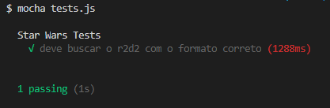

# Módulo 03 - Testes automatizados 🚀

Neste módulo é feito a criação de teste unitário utilizando mocha.

****

## 🤯 Configuração do ciclo de testes

- `npm init -y` => Inicia o projeto com Node.js
- `npm install axios` => Instala a biblioteca Axios (nessa aula usamos para consumir a [API do Star Wars](https://swapi.co/))
- `require('assert')` => Importa a biblioteca ao projeto
- `npm install -g mocha` => Instala a biblioteca Mocha globalmente
- `npm i --save-dev mocha` => Instala o Mocha como dependência de desenvolvimento
- `npm install nock` => Instala o pacote nock, para simular requisições
- `mocha tests.js` => Roda o arquivo de testes

****

## 😍 Resultado

