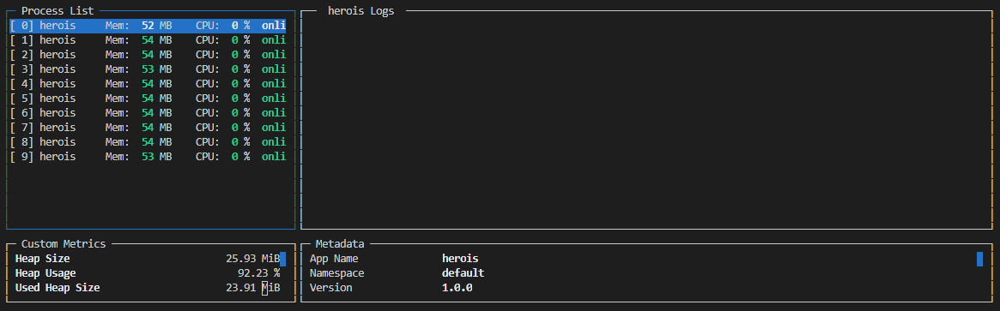
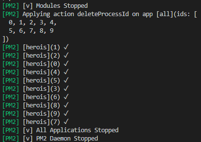

# 🤯 Módulo 12 - Módulo 12 - Publicação de serviços na Web

## Aulas

- [x] Introdução ao Capítulo
- [x] Trabalhando com multi-environments (development, production)
- [x] MongoDB online e gratuito com Mongo Lab
- [x] [Publicação de nossos serviços e bancos de dados gratuitos com Heroku](./app-heroku)
- [x] Trabalhando com PM2 para gerência de apps
- [ ] Expondo cobertura de código com Instanbul

***

## Pacotes

- `npm i dotenv`
- `npm i -g cross-env`
- `cross-env NODE_ENV=prod npm t`
- `npm run test:prod`
- `npm install -g heroku`

## Comandos heroku para publicação via terminal

- `heroku login`
- `heroku apps:list` - lista tudo o que tem na nossa conta publicado
- `heroku apps:create cursonodebr-leticiacamposs2` - Gera a url com esse comando, nesse caso: https://cursonodebr-leticiacamposs2.herokuapp.com/ e https://git.heroku.com/cursonodebr-leticiacamposs2.git
- `git remote -v`
- `git init`  
- `heroku git:remote --app cursonodebr-leticiacamposs2` - retorna: set git remote heroku to https://git.heroku.com/cursonodebr-leticiacamposs2.git
- `heroku apps:destroy` - caso queira excluir um app heroku 

- `git add .`
- `git commit -m "v1"` 
- `git push heroku master` - gera a url https://git.heroku.com/cursonodebr-leticiacamposs2.git
- `heroku logs` 

## Link da aplicação

- Documentação da API Herois: https://cursonodebr-leticiacamposs2.herokuapp.com/documentation#/

## Trabalhando com PM2 para gerência de apps
A aplicação esta no ar em produção, quais os problemas trabalhando com node.js? 

### Problemas comuns:
- Comando node arquivo.js se algo inesperado ocorrer, tudo para!
- É necessário reiniciar tudo de novo manualmente
- Impossível escalar
- Necessário uma ferramenta de gestão de aplicação

### PM2 key metrics

Objetivo: linkar o projeto ofline com o projeto online, desta forma qualquer problema, monitoramente de cpu, logs e tudo o que acontecer na aplicação da para visualizar nesse painel sem ter que olhar os logs do heroku

- [Site PM2](https://pm2.keymetrics.io/)
- `npm install -g pm2`
- `pm2 link ca36kfz26o9xnum bcqqy8gvcf9fnhn`
- `pm2 start app.js`

- Dentro do package.json altera a linha: `"prod": "cross-env NODE_ENV=prod pm2-runtime api.js"`
- `npm run prod`
- `pm2 start --name herois -i 10 api.js`- crio 10 cluster

- `pm2 monit` - mostra todas as aplicações que estão rodando na minha maquina de forma detalhada

- `pm2 kill` - mata todas as aplicações que estão de pé

- `heroku config:set PM2_PUBLIC_KEY=(PASSSA A CHAVE) PM2_SECRET_KEY=(PASSA A SENHA)` - este comando consigura o PM2 ao heroku 
