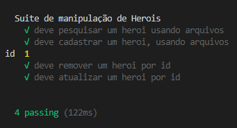

# Módulo 04 - Node.js além da Web - Criando ferramentas de linha de comando 🚀

Criando uma aplicação usando javascript, promises, testes, async/await com ferramentas de linha de comando fazendo um CRUD baseado em arquivos.

****

## 🤯 Aulas

- [x] Introdução ao Capítulo
- [x] Manipulando arquivos - READ
- [x] Manipulando arquivos - CREATE
- [x] Manipulando arquivos - DELETE
- [x] Manipulando arquivos - UPDATE
- [x] Criando ferramentas de linha de comando


****

## Anotações da aula

- `npm install --save-dev mocha` => Adiciona a biblioteca de testes ao projeto
- `npm install commander` => Instala o pacote Commander para utilização de ferramentas de linha de comando.
- `index.js --help`=> A inserção do commander trará informações ao rodar o node
- `node index.js -V` => Para versão

<p>Ao passar a variável entre chaves, ele pegará o primero elemento do array:</p>

```
const [resultado] = await database.listar(resultadoEsperado.id)
```

<p>Para outras posições:</p>

```
const [resultado, posicao2, posicao3] = await database.listar(resultadoEsperado.id)
```

- `it.only` => executa somente um teste

****

## Resultado dos testes

