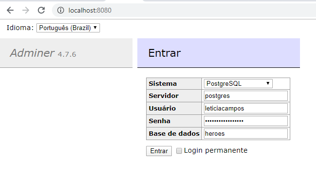
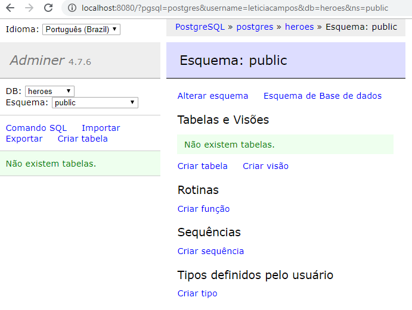
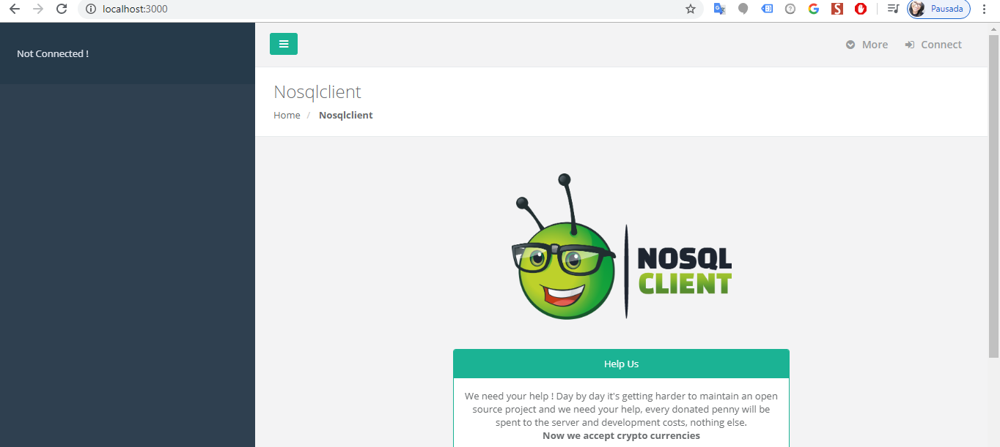

# Módulo 05 - Banco de Dados
Nosso projeto Multi-banco de dados 🚀

****

## 🤯 Aulas

- [x] Criando projetos multi-bancos de dados
- [x] Trabalhando com o padrão Strategy para multi datasources
- [x] Design Patterns - Strategy
- [x] [Demonstração multi datasources com strategy design pattern](./design-patterns)

****

## Inicialização e Configuração do Docker

<b>Note:</b> Todos os comandos à seguir devem ser executados no terminal do Docker ("Docker Quickstart Terminal")

## Postgres

- Configurando a imagem do postgres

```
docker run
     --name postgres
     -e POSTGRES_USER=leticiacampos
     -e POSTGRES_PASSWORD=minhasenhasecreta
     -e POSTGRES_DB=heroes
     -p 5432:5432
     -d
     postgres
```

- Ver as imagens instaladas na máquina

`docker ps -a`

- Entrar no container postgres

`docker exec -it postgres /bin/bash`

- Sair do container

`exit`

- Após conseguir entrar e sair do container postgres, roda o comando abaixo para iniciar a interface

```
docker run
     --name adminer
     -p 8080:8080
     --link postgres:postgres
     -d
     adminer
```

- Acesse `http://localhost:8080/`






## MongoDB

- Configurando a imagem do MongoDB

```
docker run
     --name mongodb
     -p 27017:27017
     -e MONGO_INITDB_ROOT_USERNAME=admin
     -e MONGO_INITDB_ROOT_PASSWORD=senhaadmin
     -d
     mongo:4
```

- Configurando um Client para o MongoDB

```
docker run
     --name mongoclient
     -p 3000:3000
     --link mongodb:mongodb
     -d
     mongoclient/mongoclient
```

- Cria um usuário (admin) para acessar o mongo, também criar um banco de dados (herois) e realiza o login no mesmo

```
docker exec -it mongodb \
     mongo --host localhost -u admin -p senhaadmin --authenticationDatabase admin \
     --eval "db.getSiblingDB('herois').createUser({user: 'leticiacampos', pwd: 'minhasenhasecreta', roles: [{role: 'readWrite', db: 'herois'}]})"
```

- Acesse `http://localhost:3000/`



## Outros comandos necessários do docker

- Para ver todas as imagens que estão na máquina:

`docker ps -a`

- Para iniciar uma imagem que está instalada na máquina:

`docker start id_ou_nome_da_imagem`

- Para parar uma imagem que está instalada na máquina:

`docker stop id_ou_nome_da_imagem`

- Para remover uma imagem da máquina:

`docker rm id_ou_nome_da_imagem`

****

<b>Note:</b> [outros comandos mais utilizados no docker](https://woliveiras.com.br/posts/comandos-mais-utilizados-no-docker/#Comoeuseiquaisasimagensdisponveisnomeurepositriolocal)
